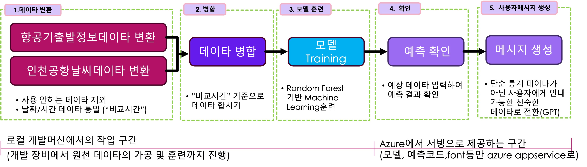

# 기상 예보에 따른 항공기 출발 지연, 취소 예측

## 목적
  * 인천국제공항 근처에 갔을때에 로밍 안내 문자가 발송됨
  * 해당 문자에 현재 기상 날씨에 따른 "항공기 이륙 지연이나 취소 가능성이 있는지"에 대한 내용을 추가

## 구현 아이디어
+ 2024년 한해의 항공기 이륙 정보 수집 
  + 데이타 출처 (에어포탈 : https://www.airportal.go.kr/airport/aircraftInfo.do)
+ 2024년 공항 날씨 정보 수집
  + 데이타 출처 (기상철 깅상정보개발포털 : https://data.kma.go.kr/data/air/selectAmosRltmList.do?pgmNo=575)
+ 해당 데이타를 가지고 날씨와 이륙에 대한 상관 관계 분석하여 모델링 구축
+ 모델링 데이타를 가지고 산출한 데이타는 출발,지연,취소 가능성이 확률로 나오므로, 이를 경량화된 LLM을 통하여 친숙한 문장으로 표현

## 구현 방법
+ 최초에는 LLM으로 분석 모델링을 구축하려했으나, 친절한 GPT와 Gemini가 직접하는 것을 극구 사양하면서 Deep-Learning알고리즘 사용을 추천함(예측정확도, 비용의 문제)
+ 데이타 모델링 구축에는 Deep-Learning (Random Forest)를 사용
+ 이 모델링을 사용한 결과의 _친숙한_ 표현에는 ChatGPT4-o mini를 사용

## 상세 구현 및 문제 해소

1. 각각 원천 데이타(날씨 및 항공기 출발 데이타)의 에러핸들링, 불필요한 데이타 제거
   + 항공기 출발 데이타의 경우
     + 지연, 취소 사례가 "기상에 의한 지연"이 아닌 경우는 항목 제외 
     + 일자, 계획시간(일정에 등록된 출발 예쩡 시간), 상태를 제외한 "출발/도착","공항명,"항공사","편명"등의 불필요한 항목 제외
     + 일자, 계획시간, 상태에 데이타가 하나라도 없으면 항목 제거
     + 일자, 계획시간, 상태 데이타가 "" 또는 ":"로 들어있는 경우도 항목 제거"
     + 일자(20241201), 계획시간(02:35) 데이타를 가공해서 일관된 형태인 "비교시간" (2024.12.01 02) 필드를 생성하여 추가
   + 날씨 데이타의 경우
     + "지점","지점명","일기현상" 데이타 제거 (일기현상의 경우, 예보 데이타없어서 제거)
     + "풍속","순간풍속" 데이타가 knot단위(KT)여서 m/s로 변경 저장
     + "일시" 데이타를 "비교시간"으로 변경하여 추가 
2. 두 임시 데이타를 한개로 병합 
   + 항공기출발정보 데이타의 오른쪽에 인천공항기상데이타의 정보를 추가 ("비교시간"이 같은 데이타 기준) 
3. 모델링 데이타 생성
   + scikit-learn에서 제공해주는 random forest 모델로 훈련
     + 입력 데이타 : "풍속(m/s)", "풍향(deg)", "시정(m)", "강수량(mm)", "순간풍속(m/s)" 기준으로
     + 결과 : "상태"데이타를 "출발","지연","취소"의 데이타를 산출 할수 있도록 설정
4. 예측 데모페이지 제작
   + stremlit을 사용한 python web ui화면으로 제작
     + 1,2,3시간의 기상 데이타 입력하면 안내 문구 노출
   + azure appservice를 사용하여 서비스 제공
   + azure openai를 사용하여 gpt4o-mini연동
  
## 결과 페이지 
[데모페이지](https://appservice-mandolin-flight-delay.azurewebsites.net "데모페이지")

## 문제 및 개선이 필요한 사항
 + 완성도의 측면 : 
   + 현재 공항 날씨 데이타를 기상청에서 가져와서 자동화하고 싶었으나, 크롤링/API방식 모두 에러 발생으로 진행 못함.
   + 원천 데이타의 품질 문제 : _데이타 깨진게 왜 이렇게 많은가 ? 수집안된 데이타도 다수!_
   + 예측 모델로의 한계 
     + _활주로 노면 상태, 누적적설량등의 데이타 부재로, 예측에 한계_
     + ___무엇보다도, 기상으로 인한 취소 확률이 100%라고 해도 당장 짐싸들고 집에 갈사람이 있을까 ?___
 + 프롬프트의 중요성 체감
   + 잘 요약해서 사용자에게 안내했으면 했지만, 실제로는 사람이 하는 것만큼 아직은 깔끔하지 않았음.
   + (그럴리는 없지만) 만약 서비스 될 경우에는 "불쾌한 골짜기" 사례가 되지 않도록 프롬프트에 주의가 필요
 + 방법론적인 문제
   + 현재는 규모가 작기때문에 로컬에서 모델 생성에 문제가 없었으나, 규모가 큰 데이타의 경우 Azure AI Search로 올리고 작업하는게 합리적일 것으로 보임
   + Azure로 올려서 수행하는 방법으로는 아래의 방법이 있을것으로 생각됨
     + Azure Data Factory를 활용하는 방안
     + Azure Function을 사용하는 방안 (실제로 배치성으로 모델을 생성하면 되니, 이 방안이 합리적일 것으로 보임)
 

## 후기
- 도와준 놈들!
  - 기획서 정리, 개발 방법, 코딩 어시스턴트 및 Azure설정 조언 : ChatGPT,Gemini,Claude
  - 개발에 정말 도움이 되는것 같으나, 코드가 점점 너저분해지고, 검수를 잘못하면 결과물이 산으로 가는 것을 여러번 경험
  - 요구사항만 명확하면 정말 좋은 결과물을 주지만, 가끔 주제넘게 시키지도 않은 짓을 하곤 함. 어떨때에는 의외의 독창성을 발휘함
  

      